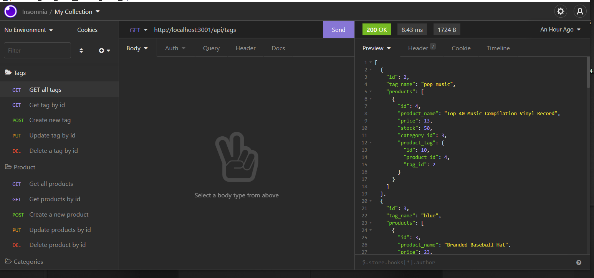

# E-Commerce Back End Database
   
---

## Description 

  
This is a back end database using Sequelize to interact with a MySQL database. Take a working Express.js API and configure it to use Sequelize to interact with a MySQL database. This is for a e-commerce application environment. There is no front-end code nor a deployed site as this is only the database and routes logic. 

### Screenshot

## Link to Video  
#### (To demonstrate functionality)
https://drive.google.com/file/d/1m3HSrC5jsHZYOwcrgXk6X8icggLvAhwH/view

---
  
## Table of Contents 

* [Installation](#installation)
* [Usage](#usage)
* [Contributing](#contributing)
* [Tests](#tests)
* [Questions](#questions)
* [Credits](#credits)
* [License](#license)

---
---

## Installation
To install, first download or clone the repo, then run npm install to install the following dependencies: 
* Node.js
* Express.js
* Sequelize.js
* dotenv
* mysql2

Additionally, you will need to have MySQL installed for this to work.

---
---

## Usage

This is a node based application. To use this application, you must clone it locally to your machine and have node installed to use it. If you want to use locally, create a .env file in the root directory and add the following:

DB_NAME='ecommerce_db'

DB_USER='Your MySQL Username>'

DB_PW='Your MySQL Password'

Once the .env is set up, you will need to create the database. You can do that by opening a terminal in the root directory and starting MySQL. Then run source db/schema.sql in MySQL. Afterward, you can use the provided seeds in the seeds folder to seed your database. Feel free to rename the products, categories, and tags. Then run npm run seed to seed the database. You can also enter items one by one through the api endpoints.

Run npm start to start the server.

Products will be located at /api/products. Categories will be located at /api/categories. Tags will be located at /api/tags. Use the add the id for the product/category/tag to target a specific item to view, update, or delete.

---
---

## License

Information on the license(s)

https://opensource.org/licenses/MPL-2.0

---
---

## Contributing

Guidelines for contributions:

NA

---
---

## Tests

NA

---
---

## Questions?

Contact me at

Email: [tooqk4u@protonmail.com](mailto:tooqk4u@protonmail.com)

GitHub: [tooqk4u](https://github.com/tooqk4u).

 ---
 ---

## Credits 
 
Shelley Soucie
Phil Loy (tutor)

---
---

[Back to Contents](#table-of-contents)
